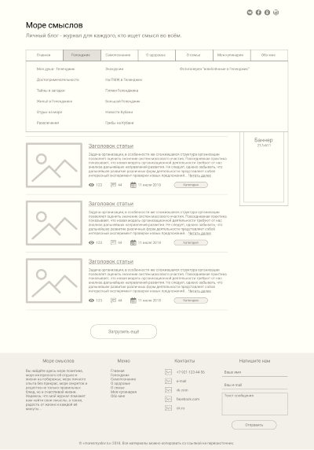
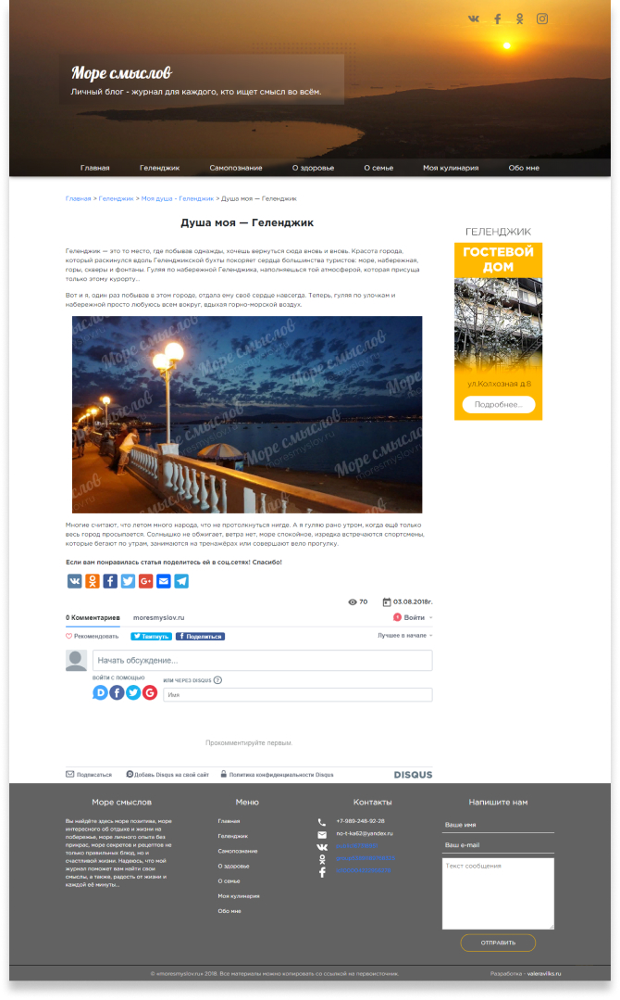
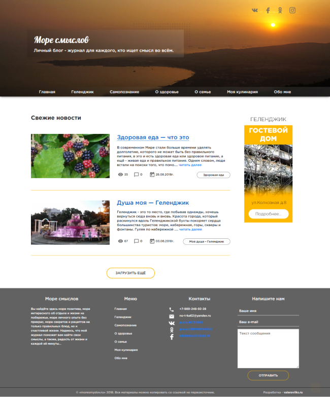

# Create a Wordpress Blog

The aim of the project was to develop a blog for the city of Gelendzhik. The site should have had an administrative panel for conveniently adding news.

For the project, a prototype was first developed, and then the full design of all pages, after which layout was made and installed on Wordpress.

